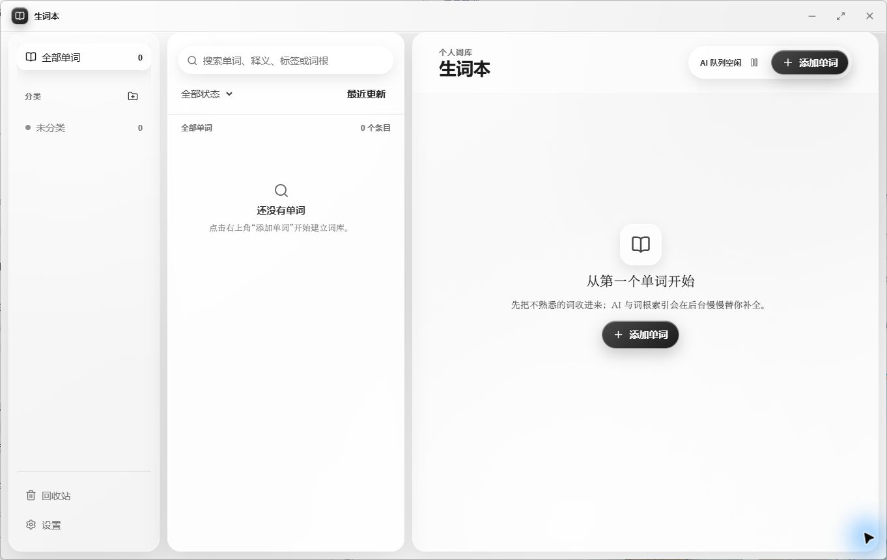

# 生词本

一个本地优先、AI 辅助的英语单词收藏库。

它只做一件事：把遇到的生词收好，并让查找、分类和编辑足够轻松。界面采用无框、无彩色的三栏结构；词库保存在本机，配置 DeepSeek API 后会在后台自动补全内容。

`Windows` · `Electron` · `React` · `TypeScript` · `SQLite` · `DeepSeek API`



## 能做什么

- 收藏单词，并记录英式 IPA、词性与中文释义
- 搜索单词、释义、分类、标签、词素和构词说明
- 用主分类整理主题，用标签建立交叉关系
- 通过 DeepSeek 自动生成并应用 IPA、释义、分类、标签和词素分析
- AI 处理完成后直接归档，不增加人工确认步骤
- 将 AI 拆出的前缀、词根和后缀与本地辞典合并，可核实条目可跳转到原文
- 将误删内容暂存到回收站，支持恢复或一键永久清空
- 以 JSON、CSV 或 SQLite 格式导出数据
- 每小时检查一次跨日备份，并保留最近 7 份

## 设计

界面围绕“词”这个核心对象展开：

1. 左栏负责词库与分类。
2. 中栏负责搜索、筛选和选择。
3. 右栏负责查看与编辑。

没有传统菜单栏，也没有装饰性色彩。层级依靠间距、字重、半透明材质和运动反馈建立；动画只用于说明状态变化，并自动尊重系统的“减少动态效果”设置。

## 从源码运行

需要 Node.js 22 或更高版本，以及 Windows 10/11。

```powershell
git clone https://github.com/Kiasma1/shengciben.git
cd shengciben
npm install
npm run dev
```

构建 Windows 安装包：

```powershell
npm run build:win
```

安装包会生成在 `release/` 目录。

## 配置 DeepSeek

AI 功能完全可选。没有配置 API Key 时，单词仍会正常收藏并留在等待队列；保存有效 Key 后，应用会自动继续处理。

1. 在 [DeepSeek 开放平台](https://platform.deepseek.com/api_keys)创建 API Key。
2. 打开“设置 → DeepSeek AI”，粘贴 API Key。
3. 保持 API 地址为 `https://api.deepseek.com`。
4. 选择模型并保存：

   - `deepseek-v4-flash`：默认，响应更快、成本更低。
   - `deepseek-v4-pro`：能力更强，通常更慢、成本更高。

API Key 会使用 Electron 的系统安全存储加密后写入本机。一次请求会生成英式 IPA、词性、中文释义、分类、标签和构词分析，并直接写入词库；不适合可靠拆分的单词允许返回空词素列表。升级后的旧词会在低优先级后台队列中逐个补全。

## 配置词根辞典

请在“设置 → 词根辞典”中选择本地的《英语词根词源分类辞典》HTML 文件。应用会建立本地索引，将 DeepSeek 拆出的词素反查到辞典规范词根，并明确区分“本地辞典”和“AI 解析”两种来源。

辞典文件不包含在本仓库中。首次选择、重建或更换辞典后，已有词素会自动重新核验；找到证据的 AI 词素会升级为辞典来源，辞典未收录的词素仍保留为 AI 解析。

## 数据与隐私

- 词库使用 SQLite 保存在 Electron 的系统用户数据目录中。
- 点击“设置 → 打开数据目录”可以直接查看数据库和备份。
- DeepSeek API Key 使用操作系统安全存储加密，不会回显到设置界面。
- AI 补全会把当前单词和已有分类名发送至 DeepSeek API；释义、标签和完整词库不会被批量上传。
- 应用不包含账号、遥测、云同步或在线词典请求。
- 卸载应用不会主动删除词库数据。

## 开发与验证

```powershell
# 类型检查
npm run typecheck

# 自动化测试
npm test

# 生产构建
npm run build
```

词根索引还提供一次确定性随机审计：它会从指定辞典抽取多组各 100 个样本，检查词根、来源锚点、去重和误匹配。

```powershell
npm run test:roots:random -- "D:\path\to\dictionary.html"
```

## 项目结构

```text
src/
├─ main/       Electron 主进程、SQLite、AI 队列与词根索引
├─ preload/    受限 IPC 接口
├─ renderer/   React 界面
└─ shared/     共享 TypeScript 类型
tests/         数据库、导出、队列与词根索引测试
```

## 当前状态

项目目前处于 `0.1.1` 阶段，优先支持 Windows 桌面端。核心的收藏、搜索、分类、AI 补全、词根关联、回收站、导出和备份流程已经可用。

## 许可证

[MIT](LICENSE)
